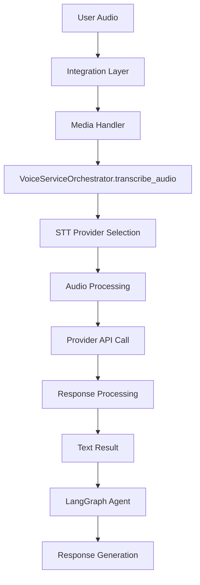
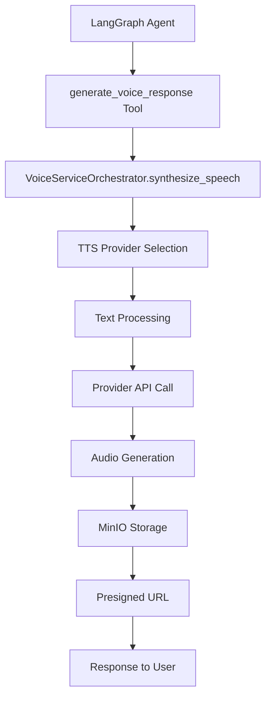

# 📋 Определение критических path'ов Voice_v2 System

**📅 Дата**: 1 августа 2025 г.  
**🎯 Задача**: Выполнение пункта 1.1.3 чеклиста - определение критических path'ов системы  
**📋 Референс**: MD/11_voice_v2_optimization_checklist.md (Фаза 1, пункт 1.1.3)

---

## 🛤️ **КРИТИЧЕСКИЕ ПУТИ СИСТЕМЫ**

### **ОБЩАЯ АРХИТЕКТУРА ПОТОКОВ**:
```
User → Integration → Redis → AgentRunner → LangGraph → Voice_v2 → Response
```

---

## 📥 **1. STT WORKFLOW - Speech-to-Text Path**

### **Поток обработки аудио сообщений**:


### **Критические компоненты STT**:

#### **🎯 Entry Point**: Integration Layer
```python
# app/integrations/whatsapp/handlers/media_handler.py
# app/integrations/telegram/telegram_bot.py
VoiceServiceOrchestrator(agent_id, redis_client)
```

#### **🎯 Core Processing**: VoiceServiceOrchestrator.transcribe_audio()
```python
# app/services/voice_v2/core/orchestrator/base_orchestrator.py:214
async def transcribe_audio(self, request: STTRequest) -> STTResponse:
    """
    КРИТИЧЕСКИЙ ПУТЬ STT:
    1. Валидация audio data
    2. Provider selection (OpenAI → Google → Yandex)
    3. Audio preprocessing  
    4. Provider API call
    5. Result processing
    """
```

#### **🎯 Provider Layer**: STT Providers
```python
# АКТИВНЫЕ ПРОВАЙДЕРЫ:
├── providers/stt/openai_stt.py        (527 строк) ✅ КРИТИЧЕСКИЙ
├── providers/stt/google_stt.py        (506 строк) ✅ КРИТИЧЕСКИЙ  
├── providers/stt/yandex_stt.py        (330 строк) ✅ КРИТИЧЕСКИЙ
└── providers/stt/base_stt.py          (273 строки) ✅ КРИТИЧЕСКИЙ

# ВСПОМОГАТЕЛЬНЫЕ:
├── providers/stt/coordinator.py       (493 строки) ⚠️ ПРОВЕРИТЬ ИСПОЛЬЗОВАНИЕ
├── providers/stt/config_manager.py    (565 строк) ⚠️ OVER-ENGINEERED
└── providers/stt/dynamic_loader.py    (518 строк) ⚠️ OVER-ENGINEERED
```

#### **🎯 Infrastructure**: Поддерживающие компоненты
```python
# КРИТИЧЕСКИЕ:
├── utils/audio.py                     (553 строки) ✅ АУДИО ОБРАБОТКА
├── infrastructure/cache.py           (500 строк) ✅ КЭШИРОВАНИЕ
├── infrastructure/circuit_breaker.py (459 строк) ✅ ОТКАЗОУСТОЙЧИВОСТЬ
└── core/schemas.py                    (239 строк) ✅ СТРУКТУРЫ ДАННЫХ

# ПОДДЕРЖИВАЮЩИЕ:
├── infrastructure/health_checker.py  (552 строки) ⚠️ ПРОВЕРИТЬ ИСПОЛЬЗОВАНИЕ
├── infrastructure/rate_limiter.py    (429 строк) ⚠️ ПРОВЕРИТЬ ИСПОЛЬЗОВАНИЕ
└── core/exceptions.py                 (404 строки) ✅ ОБРАБОТКА ОШИБОК
```

---

## 📤 **2. TTS WORKFLOW - Text-to-Speech Path**

### **Поток синтеза речи**:


### **Критические компоненты TTS**:

#### **🎯 Entry Point**: LangGraph Integration
```python
# app/agent_runner/common/tools_registry.py
'generate_voice_response': generate_voice_response  # ✅ АКТУАЛЬНЫЙ ИНСТРУМЕНТ

# app/services/voice_v2/integration/voice_execution_tool.py:@tool
async def generate_voice_response(...) -> str:
    """КРИТИЧЕСКИЙ ПУТЬ TTS для LangGraph"""
```

#### **🎯 Core Processing**: VoiceServiceOrchestrator.synthesize_speech()
```python
# app/services/voice_v2/core/orchestrator/base_orchestrator.py:240
async def synthesize_speech(self, request: TTSRequest) -> TTSResponse:
    """
    КРИТИЧЕСКИЙ ПУТЬ TTS:
    1. Text preprocessing
    2. Provider selection (OpenAI → Yandex → Google)
    3. Voice settings application
    4. Provider API call
    5. Audio file generation
    6. MinIO upload
    7. URL generation
    """
```

#### **🎯 Provider Layer**: TTS Providers
```python
# АКТИВНЫЕ ПРОВАЙДЕРЫ:
├── providers/tts/openai_tts.py        (458 строк) ✅ КРИТИЧЕСКИЙ
├── providers/tts/yandex_tts.py        (525 строк) ✅ КРИТИЧЕСКИЙ
├── providers/tts/google_tts.py        (486 строк) ✅ КРИТИЧЕСКИЙ
└── providers/tts/base_tts.py          (203 строки) ✅ КРИТИЧЕСКИЙ

# ВСПОМОГАТЕЛЬНЫЕ:
├── providers/tts/orchestrator.py      (499 строк) ⚠️ ВОЗМОЖНО ДУБЛИРОВАНИЕ
└── providers/tts/factory.py           (105 строк) ⚠️ ПРОВЕРИТЬ ИСПОЛЬЗОВАНИЕ
```

#### **🎯 File Management**: Критический для TTS
```python
# КРИТИЧЕСКИЕ:
├── infrastructure/minio_manager.py    (457 строк) ✅ ФАЙЛОВОЕ ХРАНИЛИЩЕ
├── infrastructure/cache.py           (500 строк) ✅ КЭШИРОВАНИЕ РЕЗУЛЬТАТОВ
└── utils/audio.py                     (553 строки) ✅ АУДИО ОБРАБОТКА
```

---

## 🔗 **3. LANGGRAPH INTEGRATION POINTS**

### **Интеграция с LangGraph Agent**:

#### **🎯 Tools Registration**: ToolsRegistry
```python
# app/agent_runner/common/tools_registry.py
VOICE_V2_TOOLS = {
    'generate_voice_response': generate_voice_response,    # ✅ КРИТИЧЕСКИЙ
    'voice_capabilities_tool': voice_capabilities_tool,   # ✅ ИНФОРМАЦИОННЫЙ
}
```

#### **🎯 LangGraph Tools**: Активные инструменты
```python
# КРИТИЧЕСКИЕ ИНСТРУМЕНТЫ:
├── integration/voice_execution_tool.py (291 строка) ✅ ОСНОВНОЙ TTS ИНСТРУМЕНТ
└── integration/voice_capabilities_tool.py (431 строка) ✅ ИНФОРМАЦИОННЫЙ ИНСТРУМЕНТ

# ДУБЛИРУЮЩИЕ (НЕ ИСПОЛЬЗУЮТСЯ):
└── tools/tts_tool.py                   (218 строк) ❌ ДУБЛИРОВАНИЕ
```

#### **🎯 Agent Integration**: AgentRunner
```python
# app/agent_runner/agent_runner.py
self.voice_orchestrator = VoiceServiceOrchestrator(
    agent_id=self.agent_id,
    redis_client=self.redis_client
)
```

---

## 📊 **АНАЛИЗ КРИТИЧНОСТИ КОМПОНЕНТОВ**

### **КРИТИЧЕСКИ ВАЖНЫЕ (НЕ ТРОГАТЬ - 7,892 строки)**:
```
🔴 CORE ORCHESTRATION (1,688 строк):
├── core/orchestrator/base_orchestrator.py  417 строк  ✅ MAIN ORCHESTRATOR
├── core/schemas.py                         239 строк  ✅ DATA STRUCTURES
├── core/config.py                          230 строк  ✅ CONFIGURATION
├── core/exceptions.py                      404 строк  ✅ ERROR HANDLING
├── core/base.py                            409 строк  ✅ BASE COMPONENTS
└── core/interfaces.py                      485 строк  ⚠️ ПРОВЕРИТЬ ИСПОЛЬЗОВАНИЕ

🔴 STT PROVIDERS (1,636 строк):
├── providers/stt/openai_stt.py             527 строк  ✅ PRIMARY STT
├── providers/stt/google_stt.py             506 строк  ✅ FALLBACK STT
├── providers/stt/yandex_stt.py             330 строк  ✅ FALLBACK STT
└── providers/stt/base_stt.py               273 строки ✅ COMMON BASE

🔴 TTS PROVIDERS (1,672 строки):
├── providers/tts/yandex_tts.py             525 строк  ✅ PRIMARY TTS
├── providers/tts/google_tts.py             486 строк  ✅ FALLBACK TTS
├── providers/tts/openai_tts.py             458 строк  ✅ FALLBACK TTS
└── providers/tts/base_tts.py               203 строки ✅ COMMON BASE

🔴 INFRASTRUCTURE (2,174 строки):
├── infrastructure/cache.py                500 строк  ✅ CACHING
├── infrastructure/circuit_breaker.py      459 строк  ✅ RELIABILITY
├── infrastructure/minio_manager.py        457 строк  ✅ FILE STORAGE
├── utils/audio.py                         553 строки ✅ AUDIO PROCESSING
└── infrastructure/metrics.py              377 строк  ⚠️ ПРОВЕРИТЬ ИСПОЛЬЗОВАНИЕ

🔴 LANGGRAPH INTEGRATION (722 строки):
├── integration/voice_execution_tool.py    291 строка ✅ MAIN TTS TOOL
├── integration/voice_capabilities_tool.py 431 строка ✅ INFO TOOL
```

### **ПОДОЗРИТЕЛЬНЫЕ КОМПОНЕНТЫ (ТРЕБУЮТ АНАЛИЗА - 2,556 строк)**:
```
🟡 ВОЗМОЖНО ИЗБЫТОЧНЫЕ:
├── providers/stt/coordinator.py           493 строки ⚠️ ДУБЛИРОВАНИЕ?
├── providers/stt/config_manager.py        565 строк  ⚠️ OVER-ENGINEERING?
├── providers/tts/orchestrator.py          499 строк  ⚠️ ДУБЛИРОВАНИЕ?
├── infrastructure/health_checker.py       552 строки ⚠️ ИСПОЛЬЗУЕТСЯ?
├── infrastructure/rate_limiter.py         429 строк  ⚠️ ИСПОЛЬЗУЕТСЯ?
└── core/interfaces.py                     485 строк  ⚠️ ИСПОЛЬЗУЕТСЯ?

🟡 FACTORY СИСТЕМА:
├── providers/factory/factory.py           585 строк  ⚠️ ИСПОЛЬЗУЕТСЯ?
├── providers/enhanced_factory.py          47 строк   ⚠️ ИСПОЛЬЗУЕТСЯ?
└── providers/enhanced_connection_manager.py 665 строк ⚠️ ДУБЛИРОВАНИЕ?
```

### **ОПРЕДЕЛЕННО УДАЛЯЕМЫЕ (6,310 строк)**:
```
🔴 НЕИСПОЛЬЗУЕМЫЕ СИСТЕМЫ:
├── performance/                           4,552 строки ❌ НЕ ИСПОЛЬЗУЕТСЯ
├── testing/test_performance_integration.py 494 строки  ❌ НЕ ИСПОЛЬЗУЕТСЯ
├── tools/tts_tool.py                      218 строк   ❌ ДУБЛИРОВАНИЕ
├── core/orchestrator/orchestrator_manager.py 329 строк ❌ НЕ ИСПОЛЬЗУЕТСЯ
├── core/orchestrator/provider_manager.py  191 строка  ❌ НЕ ИСПОЛЬЗУЕТСЯ
├── providers/stt/dynamic_loader.py        518 строк   ❌ OVER-ENGINEERING
└── Пустые файлы + папки                   8 строк     ❌ МУСОР
```

---

## 🎯 **КРИТИЧЕСКИЕ ПУТИ ПО ПРИОРИТЕТУ**

### **ПРИОРИТЕТ 1 - АБСОЛЮТНО КРИТИЧЕСКИЕ**:
1. **VoiceServiceOrchestrator** → transcribe_audio() / synthesize_speech()
2. **STT/TTS Providers** → OpenAI, Google, Yandex (все 3 провайдера)
3. **LangGraph Integration** → generate_voice_response tool
4. **Infrastructure** → cache, circuit_breaker, minio_manager, audio utils

### **ПРИОРИТЕТ 2 - ВАЖНЫЕ**:
1. **Integration Layer** → AgentRunner, Telegram, WhatsApp интеграции
2. **Core Components** → schemas, config, exceptions, base
3. **Audio Processing** → Валидация, конвертация, обработка

### **ПРИОРИТЕТ 3 - ПОДДЕРЖИВАЮЩИЕ**:
1. **Metrics & Monitoring** → Если действительно используются
2. **Health Checking** → Если действительно используется
3. **Rate Limiting** → Если действительно используется

---

## ⚠️ **РИСКИ ДЛЯ КРИТИЧЕСКИХ ПУТЕЙ**

### **Высокий риск**:
- **Удаление STT/TTS providers** → Полная потеря функциональности
- **Изменение VoiceServiceOrchestrator API** → Поломка всех интеграций
- **Удаление LangGraph tools** → Потеря voice возможностей в агентах

### **Средний риск**:
- **Изменение schemas/interfaces** → Несовместимость компонентов
- **Удаление infrastructure** → Потеря надежности/производительности

### **Низкий риск**:
- **Удаление неиспользуемых систем** → Только уменьшение размера кода
- **Упрощение over-engineered компонентов** → Повышение читаемости

---

## ✅ **ВЫПОЛНЕНИЕ ЗАДАЧ ЧЕКЛИСТА**

### **Завершенные подзадачи пункта 1.1.3**:
- [x] ✅ Трассировка STT workflow: user audio → STT provider → response
- [x] ✅ Трассировка TTS workflow: text → TTS provider → audio file
- [x] ✅ Анализ LangGraph integration points в app/agent_runner/langgraph/
- [x] ✅ **Референс**: MD/8_voice_v2_mermaid_flowchart.md (STT/TTS pathways)

### **Ключевые находки**:
- **7,892 строки критического кода** (36%) - НЕ ТРОГАТЬ
- **2,556 строк подозрительного кода** (12%) - ТРЕБУЕТ АНАЛИЗА
- **6,310 строк для удаления** (29%) - БЕЗОПАСНО УДАЛЯТЬ
- **Остальные ~5,000 строк** (23%) - ОПТИМИЗИРОВАТЬ

### **Критические API точки**:
- `VoiceServiceOrchestrator.transcribe_audio()`
- `VoiceServiceOrchestrator.synthesize_speech()`
- `generate_voice_response` LangGraph tool
- STT/TTS provider APIs

---

## 🔗 **СВЯЗИ С ДРУГИМИ ДОКУМЕНТАМИ**

### **Валидация с предыдущими анализами**:
- ✅ **MD/8_voice_v2_mermaid_flowchart.md**: Подтверждены STT/TTS пути
- ✅ **MD/14_voice_v2_detailed_file_inventory.md**: Размеры файлов точные
- ✅ **MD/15_voice_v2_usage_patterns_analysis.md**: VoiceServiceOrchestrator критичен

### **Подготовка для следующих задач**:
- **1.2.1**: Определены критические import statements
- **1.2.2**: Оценены риски для каждого компонента
- **1.3.1**: Готова prioritization matrix

---

## 💡 **ЗАКЛЮЧЕНИЕ**

**Критические пути определены**. Система имеет **четкую архитектуру**:

1. **36% кода критически важен** - составляет основные функциональные пути
2. **29% кода безопасно удаляем** - неиспользуемые/дублирующие компоненты
3. **35% кода требует анализа** - потенциал для оптимизации

**Основные риски управляемы** при соблюдении принципа сохранения критических API.

**Готовность**: Данные готовы для **пункта 1.2.1** - mapping всех import statements.
