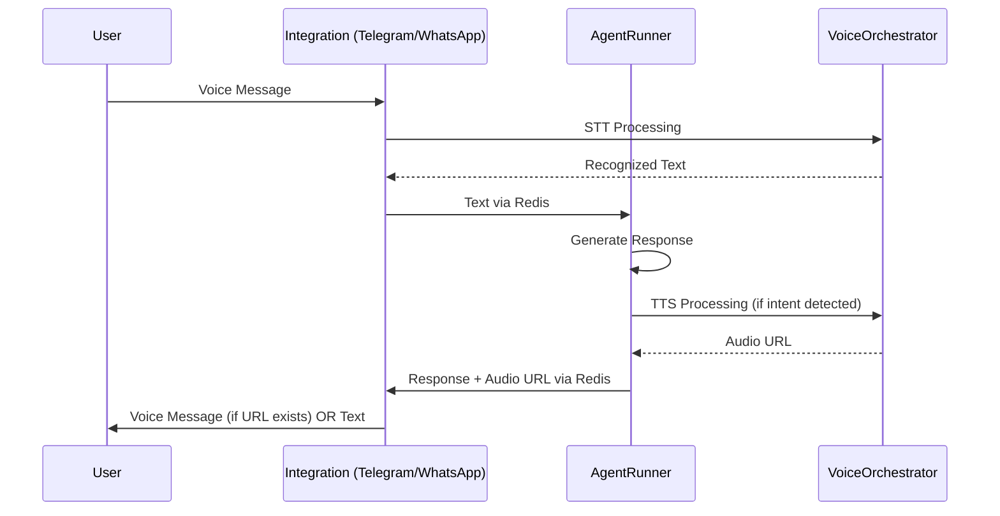

# 🎤 Анализ реализации голосовых интеграций Telegram vs WhatsApp

## 📋 Текущее состояние

### ✅ Telegram интеграция (Полностью реализована)

#### STT (Speech-to-Text) - Входящие голосовые сообщения
- **Метод**: `TelegramIntegrationBot._handle_voice_message()`
- **Поддерживаемые типы**: `voice`, `audio`
- **Алгоритм**:
  1. Валидация размера файла и продолжительности
  2. Скачивание через Telegram Bot API
  3. STT обработка через `VoiceServiceOrchestrator`
  4. Публикация распознанного текста агенту через Redis

#### TTS (Text-to-Speech) - Исходящие голосовые ответы
- **Метод**: `TelegramIntegrationBot._handle_pubsub_message()`
- **Алгоритм**:
  1. Агент генерирует ответ с `audio_url` через `AgentRunner._process_response_with_tts()`
  2. Telegram бот получает response с `audio_url`
  3. Скачивание аудиофайла по URL
  4. Отправка как voice message через `bot.send_voice()`
  5. Fallback на текст при ошибке отправки голоса

### ⚠️ WhatsApp интеграция (Частично реализована)

#### ✅ STT (Speech-to-Text) - Входящие голосовые сообщения
- **Метод**: `WhatsAppIntegrationBot._handle_voice_message()`
- **Поддерживаемые типы**: `ptt` (push-to-talk), `audio`
- **Алгоритм**:
  1. Получение через Socket.IO от wppconnect-server
  2. Скачивание медиа через wppconnect HTTP API
  3. STT обработка через `VoiceServiceOrchestrator`
  4. Публикация распознанного текста агенту через Redis

#### ❌ TTS (Text-to-Speech) - НЕ РЕАЛИЗОВАНО
- **Проблема**: `WhatsAppIntegrationBot._handle_agent_response()` игнорирует `audio_url`
- **Текущее поведение**: Отправляется только текстовый ответ

---

## 🔄 Алгоритм работы голосовых сообщений

### Общий цикл (одинаковый для обеих платформ)


### Детальный алгоритм

#### 📥 Входящие голосовые сообщения (STT)
1. **Получение аудио**:
   - Telegram: `message.voice` / `message.audio` → `bot.download_file()`
   - WhatsApp: Socket.IO event → wppconnect `/download-media` API

2. **Обработка STT** (одинаково):
   ```python
   result = await voice_orchestrator.process_voice_message(
       agent_id=agent_id,
       user_id=platform_user_id,
       audio_data=audio_data,
       original_filename=filename,
       agent_config=agent_config
   )
   ```

3. **Публикация агенту** (одинаково):
   ```python
   await redis_cli.publish(f"agent:{agent_id}:input", json.dumps({
       "text": result.text,
       "chat_id": chat_id,
       "platform_user_id": platform_user_id,
       "user_data": user_data,
       "channel": "telegram/whatsapp"
   }))
   ```

#### 📤 Исходящие голосовые ответы (TTS)
1. **Генерация агентом** (одинаково):
   ```python
   # AgentRunner._process_response_with_tts()
   success, file_info, error = await voice_orchestrator.synthesize_response_with_intent(
       agent_id=agent_id,
       user_id=chat_id, 
       response_text=response_content,
       user_message=user_message,
       agent_config=agent_config
   )
   ```

2. **Отправка ответа** (одинаково):
   ```python
   response_payload = {
       "chat_id": chat_id,
       "response": response_content,
       "channel": channel,
       "audio_url": audio_url  # Если TTS был выполнен
   }
   ```

3. **Обработка в интеграции**:
   - ✅ **Telegram**: Скачивает `audio_url` → `bot.send_voice()`
   - ❌ **WhatsApp**: Игнорирует `audio_url` → только текст

---

## 🛠️ Что нужно доделать в WhatsApp интеграции

### 1. Добавление VoiceServiceOrchestrator
**Файл**: `app/integrations/whatsapp/whatsapp_bot.py`

```python
# В __init__():
from app.services.voice import VoiceServiceOrchestrator

self.voice_orchestrator: Optional[VoiceServiceOrchestrator] = None

# В setup():
# Initialize voice orchestrator if needed
if hasattr(self, 'voice_orchestrator'):
    redis_service = RedisService()
    await redis_service.initialize()
    self.voice_orchestrator = VoiceServiceOrchestrator(redis_service, self.logger)
    await self.voice_orchestrator.initialize()
```

### 2. Модификация _handle_agent_response()
**Текущий код**:
```python
async def _handle_agent_response(self, message_data: bytes) -> None:
    data = json.loads(message_data.decode('utf-8'))
    chat_id = data.get("chat_id")
    response_text = data.get("response")
    # ... только отправка текста
    await self._send_message(chat_id, response_text)
```

**Нужно добавить**:
```python
async def _handle_agent_response(self, message_data: bytes) -> None:
    data = json.loads(message_data.decode('utf-8'))
    chat_id = data.get("chat_id")
    response_text = data.get("response")
    audio_url = data.get("audio_url")  # 🆕 Новая строка
    
    # Stop typing indicator
    if chat_id in self.typing_tasks:
        self.typing_tasks[chat_id].cancel()
        await asyncio.sleep(0.5)
    
    voice_sent_successfully = False
    
    # 🆕 Попытка отправить голосовое сообщение
    if audio_url:
        try:
            voice_sent_successfully = await self._send_voice_message(chat_id, audio_url)
            if voice_sent_successfully:
                self.logger.info(f"Voice message sent successfully to WhatsApp chat {chat_id}")
        except Exception as e:
            self.logger.error(f"Error sending voice message to WhatsApp chat {chat_id}: {e}")
    
    # Fallback на текст если голос не отправился
    if not voice_sent_successfully:
        await self._send_message(chat_id, response_text)
```

### 3. Новый метод _send_voice_message()
**Нужно добавить**:
```python
async def _send_voice_message(self, chat_id: str, audio_url: str) -> bool:
    """
    Отправка голосового сообщения в WhatsApp через wppconnect API
    
    Args:
        chat_id: ID чата WhatsApp
        audio_url: URL аудиофайла для скачивания
        
    Returns:
        True если сообщение отправлено успешно
    """
    try:
        # Скачиваем аудиофайл
        import aiohttp
        import base64
        
        async with aiohttp.ClientSession() as session:
            async with session.get(audio_url) as resp:
                if resp.status != 200:
                    self.logger.error(f"Failed to download audio from {audio_url}: HTTP {resp.status}")
                    return False
                    
                audio_data = await resp.read()
        
        # Кодируем в base64 для wppconnect API
        audio_base64 = base64.b64encode(audio_data).decode('utf-8')
        
        # Отправляем через wppconnect API
        url = f"/api/{self.session_name}/send-voice"
        payload = {
            "phone": chat_id,
            "audio": audio_base64,
            "filename": "voice_response.ogg"
        }
        
        response = await self.http_client.post(url, json=payload)
        
        if response.status_code == 200:
            return True
        else:
            self.logger.error(f"WhatsApp voice send failed: HTTP {response.status_code}")
            return False
            
    except Exception as e:
        self.logger.error(f"Error sending WhatsApp voice message: {e}", exc_info=True)
        return False
```

### 4. Очистка ресурсов в cleanup()
```python
async def cleanup(self) -> None:
    # ... существующий код ...
    
    # 🆕 Добавить очистку voice orchestrator
    if self.voice_orchestrator:
        await self.voice_orchestrator.cleanup()
        self.voice_orchestrator = None
    
    await super().cleanup()
```

---

## 📋 Ключевые различия API

| Аспект | Telegram Bot API | wppconnect-server API |
|--------|------------------|----------------------|
| **Отправка voice** | `bot.send_voice(BufferedInputFile)` | `POST /api/{session}/send-voice` с base64 |
| **Получение voice** | `message.voice` + `bot.download_file()` | Socket.IO event + `/download-media` |
| **Формат аудио** | MP3, OGG, WAV | OGG, MP3 (зависит от WhatsApp) |
| **Кодирование** | Binary file | Base64 string |

---

## ✅ План реализации

### 🔥 КРИТИЧЕСКИ ВАЖНО (Phase 1)
1. **Модифицировать `_handle_agent_response()`** - извлечение `audio_url` из Redis сообщения
2. **Реализовать `_send_voice_message()`** - отправка голосовых сообщений через wppconnect API
3. **Базовое тестирование TTS цикла**

### 🔧 Улучшения (Phase 2)  
4. **Добавить VoiceServiceOrchestrator в конструктор WhatsApp бота**
5. **Реализовать правильную очистку ресурсов в cleanup()**
6. **Добавить error handling и retry логику**

### 🚀 Оптимизация (Phase 3)
7. **Кэширование voice orchestrator экземпляра**
8. **Настройка timeout'ов для wppconnect API**
9. **Полное нагрузочное тестирование**

После реализации WhatsApp интеграция будет иметь **полный паритет** с Telegram по функциям работы с голосовыми сообщениями.

> 📄 **Детальный анализ**: См. файл `MD/voice_integration_analysis_detailed.md` для полного технического описания.
