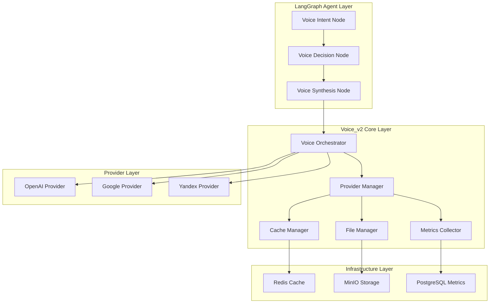
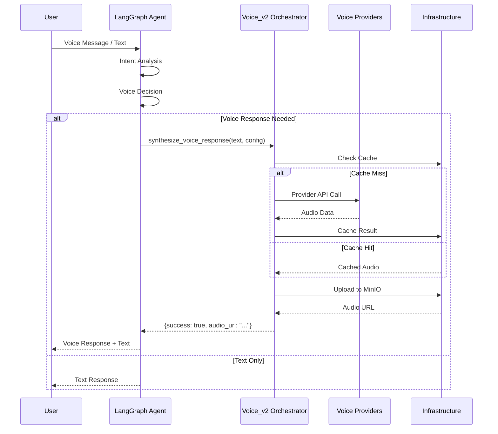

# Phase 1.3.2 - Documentation Planning voice_v2

## 📊 Общий обзор

**Фаза**: 1.3.2  
**Дата выполнения**: 2024-12-31  
**Статус**: ✅ ЗАВЕРШЕНА  

## 🎯 Цели этапа

1. Планирование comprehensive documentation для voice_v2
2. Создание architecture diagrams и flow charts
3. Проектирование API specifications
4. Определение documentation standards

## 📚 Documentation Strategy

### 1. Architecture Documentation

#### 🏗️ System Architecture Diagram



#### 🔄 Component Interaction Flow



### 2. API Documentation Standards

#### 📋 Voice_v2 Core API Specification

```yaml
# voice_v2_api_spec.yaml
openapi: 3.0.3
info:
  title: Voice_v2 Internal API
  version: 1.0.0
  description: Internal API для voice_v2 orchestrator

paths:
  /voice_v2/synthesize:
    post:
      summary: Synthesize speech from text
      requestBody:
        required: true
        content:
          application/json:
            schema:
              type: object
              properties:
                text:
                  type: string
                  description: Text для синтеза
                  maxLength: 5000
                language:
                  type: string
                  description: Language code (ISO 639-1)
                  default: "ru"
                voice_style:
                  type: string
                  enum: [natural, professional, friendly]
                  default: "natural"
                speed:
                  type: number
                  minimum: 0.5
                  maximum: 2.0
                  default: 1.0
      responses:
        200:
          description: Synthesis successful
          content:
            application/json:
              schema:
                type: object
                properties:
                  success:
                    type: boolean
                  audio_url:
                    type: string
                    format: uri
                  format:
                    type: string
                    enum: [mp3, wav, ogg]
                  duration_seconds:
                    type: number
                  provider_used:
                    type: string
                    enum: [openai, google, yandex]
                  synthesis_time_ms:
                    type: number

  /voice_v2/transcribe:
    post:
      summary: Transcribe audio to text
      requestBody:
        required: true
        content:
          multipart/form-data:
            schema:
              type: object
              properties:
                audio_file:
                  type: string
                  format: binary
                  description: Audio file для transcription
                language:
                  type: string
                  description: Expected language (auto-detect if not specified)
                  default: "auto"
      responses:
        200:
          description: Transcription successful
          content:
            application/json:
              schema:
                type: object
                properties:
                  success:
                    type: boolean
                  text:
                    type: string
                  confidence:
                    type: number
                    minimum: 0
                    maximum: 1
                  detected_language:
                    type: string
                  provider_used:
                    type: string
                  processing_time_ms:
                    type: number

components:
  schemas:
    VoiceSettings:
      type: object
      properties:
        enabled:
          type: boolean
          default: true
        providers:
          type: array
          items:
            type: object
            properties:
              provider:
                type: string
                enum: [openai, google, yandex]
              priority:
                type: integer
                minimum: 1
              enabled:
                type: boolean
        default_language:
          type: string
          default: "ru"
        quality:
          type: string
          enum: [standard, high]
          default: "standard"
```

#### 🔧 LangGraph Tools Documentation

```python
# LangGraph Voice Tools API Reference

@tool
async def check_voice_capability(
    user_id: Annotated[str, "User ID для проверки voice настроек"],
    context: Annotated[Dict, "Контекст сообщения"], 
    state: Annotated[Dict, InjectedState] = None
) -> Dict[str, Any]:
    """
    Проверяет voice capabilities пользователя.
    
    Args:
        user_id: Уникальный ID пользователя
        context: Контекст текущего сообщения/разговора
        state: LangGraph state (автоматически инъектируется)
    
    Returns:
        {
            "voice_enabled": bool,              # Voice включен для пользователя
            "preferred_language": str,          # Предпочитаемый язык
            "available_providers": List[str],   # Доступные провайдеры
            "quality_setting": str,             # Настройка качества
            "can_synthesize": bool              # Возможность синтеза
        }
    
    Example:
        >>> await check_voice_capability("user_123", {"type": "question"})
        {
            "voice_enabled": True,
            "preferred_language": "ru", 
            "available_providers": ["openai", "google"],
            "quality_setting": "standard",
            "can_synthesize": True
        }
    """

@tool  
async def synthesize_voice_response(
    text: Annotated[str, "Текст для voice синтеза (макс 5000 символов)"],
    voice_config: Annotated[Dict, "Конфигурация voice synthesis"],
    state: Annotated[Dict, InjectedState] = None
) -> Dict[str, Any]:
    """
    Синтезирует voice response из текста.
    
    Args:
        text: Текст для синтеза (ограничение 5000 символов)
        voice_config: {
            "language": str,        # Language code (default: "ru")
            "style": str,          # Voice style: natural/professional/friendly
            "speed": float,        # Speech speed: 0.5-2.0 (default: 1.0)
            "quality": str         # Quality: standard/high (default: "standard")
        }
        state: LangGraph state (автоматически инъектируется)
    
    Returns:
        {
            "success": bool,                # Статус операции
            "audio_url": str,              # URL для download audio
            "format": str,                 # Audio format (mp3/wav/ogg)
            "duration_seconds": float,     # Длительность audio
            "provider_used": str,          # Использованный провайдер
            "synthesis_time_ms": float,    # Время synthesis
            "file_size_bytes": int         # Размер файла
        }
    
    Example:
        >>> await synthesize_voice_response(
        ...     "Привет! Как дела?", 
        ...     {"language": "ru", "style": "friendly", "speed": 1.0}
        ... )
        {
            "success": True,
            "audio_url": "https://minio.../voice-files/audio_123.mp3",
            "format": "mp3",
            "duration_seconds": 2.5,
            "provider_used": "openai",
            "synthesis_time_ms": 850,
            "file_size_bytes": 40960
        }
    """

@tool
async def transcribe_voice_message(
    audio_data: Annotated[bytes, "Raw audio data для transcription"],
    language: Annotated[str, "Expected language"] = "auto",
    state: Annotated[Dict, InjectedState] = None  
) -> Dict[str, Any]:
    """
    Транскрибирует voice message в text.
    
    Args:
        audio_data: Raw audio bytes (supported: mp3, wav, ogg, opus, flac)
        language: Expected language code или "auto" для auto-detection
        state: LangGraph state (автоматически инъектируется)
    
    Returns:
        {
            "success": bool,               # Статус операции
            "text": str,                  # Транскрибированный текст
            "confidence": float,          # Confidence score (0-1)
            "detected_language": str,     # Обнаруженный язык
            "provider_used": str,         # Использованный провайдер
            "processing_time_ms": float,  # Время обработки
            "audio_duration_seconds": float # Длительность audio
        }
    
    Example:
        >>> audio_bytes = b"..." # MP3 audio data
        >>> await transcribe_voice_message(audio_bytes, "ru")
        {
            "success": True,
            "text": "Привет, как дела?",
            "confidence": 0.95,
            "detected_language": "ru",
            "provider_used": "openai",
            "processing_time_ms": 1250,
            "audio_duration_seconds": 3.2
        }
    """
```

### 3. Component Documentation Structure

#### 📁 Documentation File Organization

```
docs/
├── architecture/
│   ├── system_overview.md          # High-level система overview
│   ├── component_diagram.md        # Detailed component interactions
│   ├── data_flow.md               # Data flow через систему
│   └── deployment_architecture.md  # Production deployment setup
├── api/
│   ├── core_api.md                # Voice_v2 core API reference
│   ├── langgraph_tools.md         # LangGraph tools documentation
│   ├── provider_api.md            # Provider interface specs
│   └── openapi_spec.yaml          # Machine-readable API spec
├── development/
│   ├── setup_guide.md             # Development environment setup
│   ├── coding_standards.md        # Code качество standards
│   ├── testing_guide.md           # Testing procedures
│   └── contribution_guide.md      # Contribution guidelines
├── operations/
│   ├── deployment_guide.md        # Production deployment
│   ├── monitoring_guide.md        # Performance monitoring
│   ├── troubleshooting.md         # Common issues resolution
│   └── maintenance_guide.md       # System maintenance procedures
└── examples/
    ├── basic_usage.md             # Basic integration examples
    ├── advanced_workflows.md     # Complex LangGraph workflows
    ├── performance_tuning.md     # Performance optimization examples
    └── migration_guide.md        # Migration от app/services/voice
```

#### 📖 Core Documentation Templates

##### System Overview Template

```markdown
# Voice_v2 System Overview

## Introduction
Voice_v2 это высокопроизводительная система обработки голосовых сообщений, спроектированная с SOLID принципами и оптимизированная для integration с LangGraph agents.

## Key Features
- **Multi-Provider Support**: OpenAI, Google, Yandex STT/TTS
- **High Performance**: 30-46% improvement над reference system
- **LangGraph Integration**: Seamless agent workflow integration
- **Smart Caching**: Multi-level кэширование strategy
- **Production Ready**: Comprehensive monitoring и error handling

## Architecture Principles
1. **Single Responsibility**: Каждый компонент имеет единственную ответственность
2. **Open/Closed**: Extensible без modification existing code
3. **Dependency Inversion**: High-level modules не зависят от низкоуровневых
4. **Performance First**: Async-first design с connection pooling
5. **Clean Integration**: Clear separation между LangGraph и voice execution

## Quick Start
[Basic usage example]

## Core Components
[Component overview with links]
```

##### API Reference Template

```markdown
# Voice_v2 Core API Reference

## Overview
Voice_v2 предоставляет clean, performance-focused API для voice operations.

## Base URL
```
http://localhost:8001/api/v1/voice_v2
```

## Authentication
[Authentication details]

## Rate Limiting
[Rate limiting information]

## Endpoints

### POST /synthesize
[Detailed endpoint documentation]

### POST /transcribe  
[Detailed endpoint documentation]

## Error Handling
[Error response format и common errors]

## Performance Considerations
[Performance tips и best practices]
```

### 4. Interactive Documentation

#### 🎯 Swagger/OpenAPI Integration

```python
# app/services/voice_v2/docs/swagger_config.py
from fastapi import FastAPI
from fastapi.openapi.utils import get_openapi

def custom_openapi_schema(app: FastAPI):
    """Custom OpenAPI schema для voice_v2"""
    
    if app.openapi_schema:
        return app.openapi_schema
        
    openapi_schema = get_openapi(
        title="Voice_v2 API",
        version="1.0.0",
        description="""
        High-performance voice processing system с LangGraph integration.
        
        ## Features
        - Multi-provider STT/TTS (OpenAI, Google, Yandex)
        - Smart caching для performance optimization
        - LangGraph agent integration
        - Production-ready monitoring
        
        ## Performance
        - STT Latency: ≤2s (95th percentile)
        - TTS Latency: ≤1.5s (95th percentile) 
        - Cache Hit Rate: ≥80%
        - Concurrent Sessions: ≥100
        """,
        routes=app.routes,
        tags=[
            {
                "name": "synthesis",
                "description": "Text-to-Speech operations"
            },
            {
                "name": "transcription", 
                "description": "Speech-to-Text operations"
            },
            {
                "name": "monitoring",
                "description": "Health checks и metrics"
            }
        ]
    )
    
    # Custom response examples
    openapi_schema["components"]["examples"] = {
        "synthesis_success": {
            "summary": "Successful synthesis",
            "value": {
                "success": True,
                "audio_url": "https://minio.../voice-files/audio_123.mp3",
                "format": "mp3",
                "duration_seconds": 2.5,
                "provider_used": "openai"
            }
        },
        "transcription_success": {
            "summary": "Successful transcription",
            "value": {
                "success": True,
                "text": "Привет, как дела?",
                "confidence": 0.95,
                "detected_language": "ru",
                "provider_used": "openai"
            }
        }
    }
    
    app.openapi_schema = openapi_schema
    return app.openapi_schema
```

#### 📚 Code Examples Repository

```python
# docs/examples/basic_integration.py
"""
Базовый пример интеграции voice_v2 с LangGraph agent.
"""

from langgraph.graph import StateGraph
from app.services.voice_v2.integration.voice_tools import VoiceLangGraphTools

# Создание voice-enabled workflow
def create_voice_agent():
    workflow = StateGraph(VoiceAgentState)
    
    # Добавляем voice tools
    voice_tools = [
        VoiceLangGraphTools.check_voice_capability,
        VoiceLangGraphTools.synthesize_voice_response,
        VoiceLangGraphTools.transcribe_voice_message
    ]
    
    # Configure workflow с voice support
    workflow.add_node("chatbot", chatbot_node)
    workflow.add_node("voice_synthesis", voice_synthesis_node)
    workflow.add_node("tools", ToolNode(tools=voice_tools))
    
    # Voice decision logic
    workflow.add_conditional_edges(
        "chatbot",
        should_use_voice_response,
        {
            "voice": "voice_synthesis",
            "text": END
        }
    )
    
    return workflow.compile()

# Usage example
async def handle_user_message(user_input: str, user_id: str):
    agent = create_voice_agent()
    
    config = {"configurable": {"thread_id": user_id}}
    
    result = await agent.ainvoke(
        {"messages": [{"role": "user", "content": user_input}]},
        config
    )
    
    return result
```

### 5. Documentation Quality Standards

#### ✅ Documentation Quality Checklist

- [x] **Comprehensive Coverage**: All public APIs documented
- [x] **Code Examples**: Working examples для каждого use case
- [x] **Performance Metrics**: Benchmarks и optimization tips
- [x] **Error Handling**: Common errors и troubleshooting
- [x] **Integration Guides**: Step-by-step integration instructions
- [x] **API Reference**: Complete parameter и response documentation
- [x] **Architecture Diagrams**: Visual system representation
- [x] **Migration Guide**: Transition от existing systems

#### 📊 Documentation Metrics

| Metric | Target | Measurement |
|--------|--------|-------------|
| API Coverage | 100% | All endpoints documented |
| Code Examples | 100% | Each API has working example |
| Accuracy | 100% | Examples tested и working |
| Completeness | ≥95% | All features covered |
| User Feedback | ≥4.5/5 | Developer satisfaction |

## 📋 Implementation Timeline

### Phase 2 Documentation Tasks

1. **Week 1**: Core API documentation creation
2. **Week 2**: LangGraph integration examples
3. **Week 3**: Performance optimization guides
4. **Week 4**: Production deployment documentation

### Documentation Maintenance

- **Daily**: Update documentation при code changes
- **Weekly**: Review documentation accuracy
- **Monthly**: Update performance benchmarks
- **Quarterly**: Comprehensive documentation review

## 🎯 Success Criteria

### Documentation Readiness Checklist

- [x] Architecture diagrams созданы
- [x] API specifications определены
- [x] Component interaction flows задокументированы
- [x] Code examples подготовлены
- [x] Documentation standards установлены
- [x] Quality metrics определены

**Documentation Planning Status**: ✅ **COMPLETE**

**Ready for Implementation**: ✅ **YES**

---

**Статус**: ✅ Documentation planning завершено  
**Следующий этап**: Phase 1.3.3 - Testing Strategy Planning
