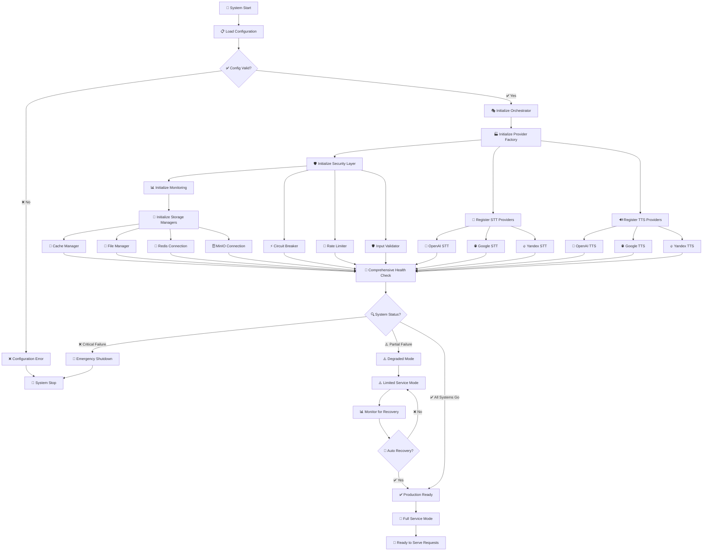
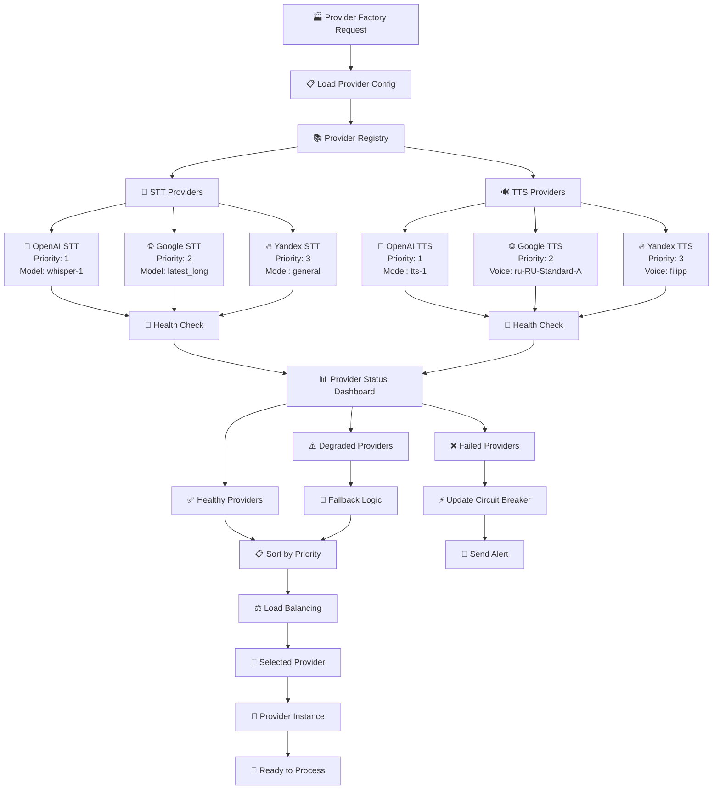
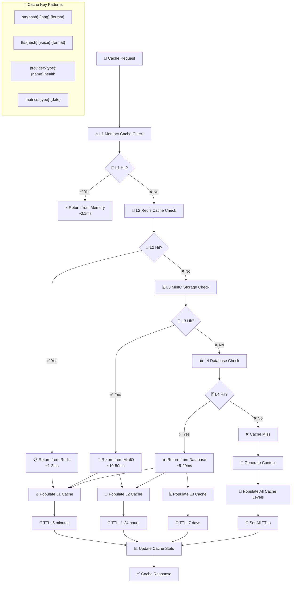
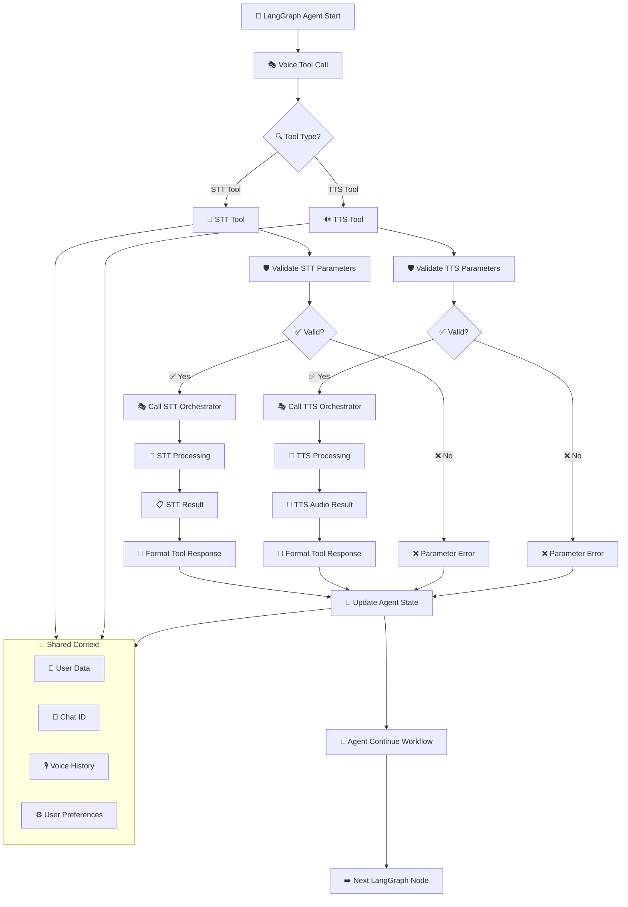

# 🎭 Voice V2 System Architecture - Updated Mermaid Flowcharts

## 📋 Overview
Этот документ содержит обновлённые Mermaid диаграммы оптимизированной архитектуры системы Voice V2, включая все компоненты, потоки данных и взаимодействия между модулями.

**Версия**: 2.0 (Post-Optimization)  
**Дата обновления**: 2 августа 2025 г.  
**Статус**: Production Ready Architecture

---

## 🏗️ **ОПТИМИЗИРОВАННАЯ СИСТЕМА ИНИЦИАЛИЗАЦИИ**

### **Процесс запуска Voice V2 системы (Optimized)**



---

## 🎯 **ГЛАВНЫЙ ПОТОК ОБРАБОТКИ VOICE ЗАПРОСОВ**

### **Unified Voice Request Processing Flow (Optimized)**

```mermaid
graph TB
    %% =================================
    %% REQUEST ENTRY POINT
    %% =================================
    REQUEST_START[🎙️ Voice Request] --> REQUEST_TYPE{Request Type?}
    
    %% =================================
    %% STT PROCESSING PATHWAY
    %% =================================
    REQUEST_TYPE -->|STT Request| STT_ORCHESTRATOR[🎤 STT Orchestrator]
    
    STT_ORCHESTRATOR --> STT_CACHE_CHECK{📋 Check STT Cache}
    STT_CACHE_CHECK -->|💾 Hit| STT_CACHE_RESPONSE[⚡ Return Cached Result<br>0.1ms response]
    STT_CACHE_CHECK -->|💥 Miss| STT_VALIDATION[🛡️ Input Validation]
    
    STT_VALIDATION --> STT_VALIDATION_OK{✅ Valid?}
    STT_VALIDATION_OK -->|❌ No| STT_ERROR[❌ Validation Error]
    STT_VALIDATION_OK -->|✅ Yes| STT_PROVIDER_SELECTION[🏭 Provider Selection]
    
    %% STT Provider Chain
    STT_PROVIDER_SELECTION --> STT_PROVIDER_1[🤖 OpenAI STT<br>Priority: 1]
    STT_PROVIDER_1 --> STT_CHECK_1{🔍 Available?<br>Circuit Breaker OK?}
    STT_CHECK_1 -->|✅ Yes| STT_PROCESS_1[🎯 Process with OpenAI]
    STT_CHECK_1 -->|❌ No| STT_PROVIDER_2[🌐 Google STT<br>Priority: 2]
    
    STT_PROVIDER_2 --> STT_CHECK_2{🔍 Available?<br>Circuit Breaker OK?}
    STT_CHECK_2 -->|✅ Yes| STT_PROCESS_2[🎯 Process with Google]
    STT_CHECK_2 -->|❌ No| STT_PROVIDER_3[🔥 Yandex STT<br>Priority: 3]
    
    STT_PROVIDER_3 --> STT_CHECK_3{🔍 Available?<br>Circuit Breaker OK?}
    STT_CHECK_3 -->|✅ Yes| STT_PROCESS_3[🎯 Process with Yandex]
    STT_CHECK_3 -->|❌ No| STT_FALLBACK_ERROR[❌ All Providers Failed]
    
    %% STT Processing Results
    STT_PROCESS_1 --> STT_SUCCESS_1{🎯 Success?}
    STT_PROCESS_2 --> STT_SUCCESS_2{🎯 Success?}
    STT_PROCESS_3 --> STT_SUCCESS_3{🎯 Success?}
    
    STT_SUCCESS_1 -->|✅ Yes| STT_CACHE_STORE[💾 Cache Result]
    STT_SUCCESS_2 -->|✅ Yes| STT_CACHE_STORE
    STT_SUCCESS_3 -->|✅ Yes| STT_CACHE_STORE
    
    STT_SUCCESS_1 -->|❌ No| STT_PROVIDER_2
    STT_SUCCESS_2 -->|❌ No| STT_PROVIDER_3
    STT_SUCCESS_3 -->|❌ No| STT_FALLBACK_ERROR
    
    STT_CACHE_STORE --> STT_METRICS[📊 Record Metrics]
    STT_METRICS --> STT_RESPONSE[📋 STT Response]
    
    %% =================================
    %% TTS PROCESSING PATHWAY
    %% =================================
    REQUEST_TYPE -->|TTS Request| TTS_ORCHESTRATOR[🔊 TTS Orchestrator]
    
    TTS_ORCHESTRATOR --> TTS_CACHE_CHECK{📋 Check TTS Cache}
    TTS_CACHE_CHECK -->|💾 Hit| TTS_CACHE_RESPONSE[⚡ Return Cached Audio<br>0.1ms response]
    TTS_CACHE_CHECK -->|💥 Miss| TTS_VALIDATION[🛡️ Input Validation]
    
    TTS_VALIDATION --> TTS_VALIDATION_OK{✅ Valid?}
    TTS_VALIDATION_OK -->|❌ No| TTS_ERROR[❌ Validation Error]
    TTS_VALIDATION_OK -->|✅ Yes| TTS_PROVIDER_SELECTION[🏭 Provider Selection]
    
    %% TTS Provider Chain
    TTS_PROVIDER_SELECTION --> TTS_PROVIDER_1[🤖 OpenAI TTS<br>Priority: 1]
    TTS_PROVIDER_1 --> TTS_CHECK_1{🔍 Available?<br>Circuit Breaker OK?}
    TTS_CHECK_1 -->|✅ Yes| TTS_PROCESS_1[🎯 Process with OpenAI]
    TTS_CHECK_1 -->|❌ No| TTS_PROVIDER_2[🌐 Google TTS<br>Priority: 2]
    
    TTS_PROVIDER_2 --> TTS_CHECK_2{🔍 Available?<br>Circuit Breaker OK?}
    TTS_CHECK_2 -->|✅ Yes| TTS_PROCESS_2[🎯 Process with Google]
    TTS_CHECK_2 -->|❌ No| TTS_PROVIDER_3[🔥 Yandex TTS<br>Priority: 3]
    
    TTS_PROVIDER_3 --> TTS_CHECK_3{🔍 Available?<br>Circuit Breaker OK?}
    TTS_CHECK_3 -->|✅ Yes| TTS_PROCESS_3[🎯 Process with Yandex]
    TTS_CHECK_3 -->|❌ No| TTS_FALLBACK_ERROR[❌ All Providers Failed]
    
    %% TTS Processing Results
    TTS_PROCESS_1 --> TTS_SUCCESS_1{🎯 Success?}
    TTS_PROCESS_2 --> TTS_SUCCESS_2{🎯 Success?}
    TTS_PROCESS_3 --> TTS_SUCCESS_3{🎯 Success?}
    
    TTS_SUCCESS_1 -->|✅ Yes| TTS_FILE_UPLOAD[📁 Upload to MinIO]
    TTS_SUCCESS_2 -->|✅ Yes| TTS_FILE_UPLOAD
    TTS_SUCCESS_3 -->|✅ Yes| TTS_FILE_UPLOAD
    
    TTS_SUCCESS_1 -->|❌ No| TTS_PROVIDER_2
    TTS_SUCCESS_2 -->|❌ No| TTS_PROVIDER_3
    TTS_SUCCESS_3 -->|❌ No| TTS_FALLBACK_ERROR
    
    TTS_FILE_UPLOAD --> TTS_CACHE_STORE[💾 Cache Audio Data]
    TTS_CACHE_STORE --> TTS_METRICS[📊 Record Metrics]
    TTS_METRICS --> TTS_RESPONSE[🎵 TTS Response]
    
    %% =================================
    %% FINAL PROCESSING STEPS
    %% =================================
    STT_RESPONSE --> WEBHOOK_NOTIFY[📡 Webhook Notifications]
    TTS_RESPONSE --> WEBHOOK_NOTIFY
    STT_ERROR --> LOG_ERROR[📝 Log Error]
    TTS_ERROR --> LOG_ERROR
    STT_FALLBACK_ERROR --> LOG_ERROR
    TTS_FALLBACK_ERROR --> LOG_ERROR
    
    WEBHOOK_NOTIFY --> FINAL_RESPONSE[📋 Final Response]
    LOG_ERROR --> ERROR_RESPONSE[❌ Error Response]
    STT_CACHE_RESPONSE --> FINAL_RESPONSE
    TTS_CACHE_RESPONSE --> FINAL_RESPONSE
    
    FINAL_RESPONSE --> END_SUCCESS[✅ Request Complete]
    ERROR_RESPONSE --> END_ERROR[❌ Request Failed]
```



---

## 🛡️ **SECURITY & MONITORING ARCHITECTURE**

### **Security Pipeline Flow**

```mermaid
graph LR
    %% =================================
    %% SECURITY LAYERS
    %% =================================
    REQUEST[📡 Incoming Request] --> INPUT_VALIDATION[🛡️ Input Validation]
    
    INPUT_VALIDATION --> VALIDATION_CHECK{✅ Valid Input?}
    VALIDATION_CHECK -->|❌ No| SECURITY_BLOCK[🚫 Block Request]
    VALIDATION_CHECK -->|✅ Yes| RATE_LIMITING[🚦 Rate Limiting]
    
    RATE_LIMITING --> RATE_CHECK{📊 Within Limits?}
    RATE_CHECK -->|❌ No| RATE_BLOCK[🚫 Rate Limited]
    RATE_CHECK -->|✅ Yes| CIRCUIT_BREAKER[⚡ Circuit Breaker]
    
    CIRCUIT_BREAKER --> CIRCUIT_CHECK{🔌 Circuit Open?}
    CIRCUIT_CHECK -->|❌ Yes| CIRCUIT_BLOCK[🚫 Circuit Open]
    CIRCUIT_CHECK -->|✅ No| AUTH_CHECK[🔐 Authentication]
    
    AUTH_CHECK --> AUTH_VALID{🔑 Authenticated?}
    AUTH_VALID -->|❌ No| AUTH_BLOCK[🚫 Unauthorized]
    AUTH_VALID -->|✅ Yes| PROCESS_REQUEST[🎯 Process Request]
    
    %% =================================
    %% MONITORING PIPELINE
    %% =================================
    PROCESS_REQUEST --> METRICS_START[📊 Start Metrics]
    METRICS_START --> BUSINESS_LOGIC[🎭 Business Logic]
    BUSINESS_LOGIC --> METRICS_RECORD[📈 Record Metrics]
    METRICS_RECORD --> HEALTH_UPDATE[🏥 Update Health]
    HEALTH_UPDATE --> ALERT_CHECK[🚨 Check Alerts]
    
    ALERT_CHECK --> ALERT_NEEDED{🔔 Alert Needed?}
    ALERT_NEEDED -->|✅ Yes| SEND_ALERT[📧 Send Alert]
    ALERT_NEEDED -->|❌ No| SUCCESS_RESPONSE[✅ Success Response]
    
    SEND_ALERT --> SUCCESS_RESPONSE
    
    %% =================================
    %% ERROR HANDLING
    %% =================================
    SECURITY_BLOCK --> LOG_SECURITY[📝 Log Security Event]
    RATE_BLOCK --> LOG_RATE[📝 Log Rate Limit]
    CIRCUIT_BLOCK --> LOG_CIRCUIT[📝 Log Circuit Event]
    AUTH_BLOCK --> LOG_AUTH[📝 Log Auth Failure]
    
    LOG_SECURITY --> ERROR_RESPONSE[❌ Error Response]
    LOG_RATE --> ERROR_RESPONSE
    LOG_CIRCUIT --> ERROR_RESPONSE
    LOG_AUTH --> ERROR_RESPONSE
```



---

## 📊 **PROVIDER ARCHITECTURE FLOW**

### **Multi-Provider Orchestration**



---

## 💾 **CACHING & STORAGE ARCHITECTURE**

### **Multi-Tier Caching Strategy**



---

## 🔗 **INTEGRATION & WEBHOOK ARCHITECTURE**

### **External Integration Flow**

```mermaid
graph LR
    %% =================================
    %% VOICE PROCESSING COMPLETE
    %% =================================
    VOICE_COMPLETE[🎯 Voice Processing Complete] --> WEBHOOK_TRIGGER[📡 Webhook Trigger]
    
    WEBHOOK_TRIGGER --> WEBHOOK_CONFIG[⚙️ Load Webhook Config]
    WEBHOOK_CONFIG --> WEBHOOK_FILTER[🔍 Filter Active Webhooks]
    
    %% =================================
    %% WEBHOOK TYPES
    %% =================================
    WEBHOOK_FILTER --> ANALYTICS_WEBHOOK[📊 Analytics Webhook]
    WEBHOOK_FILTER --> MONITORING_WEBHOOK[🔍 Monitoring Webhook]
    WEBHOOK_FILTER --> BILLING_WEBHOOK[💰 Billing Webhook]
    WEBHOOK_FILTER --> CUSTOM_WEBHOOK[🔧 Custom Webhooks]
    
    %% =================================
    %% PAYLOAD PREPARATION
    %% =================================
    ANALYTICS_WEBHOOK --> ANALYTICS_PAYLOAD[📊 Analytics Payload<br>• Request metrics<br>• Performance data<br>• Usage statistics]
    MONITORING_WEBHOOK --> MONITORING_PAYLOAD[🔍 Monitoring Payload<br>• Health status<br>• Error events<br>• Alert conditions]
    BILLING_WEBHOOK --> BILLING_PAYLOAD[💰 Billing Payload<br>• API usage<br>• Cost tracking<br>• Provider costs]
    CUSTOM_WEBHOOK --> CUSTOM_PAYLOAD[🔧 Custom Payload<br>• User-defined data<br>• Business events<br>• Integration data]
    
    %% =================================
    %% WEBHOOK DELIVERY
    %% =================================
    ANALYTICS_PAYLOAD --> WEBHOOK_QUEUE[📮 Webhook Queue]
    MONITORING_PAYLOAD --> WEBHOOK_QUEUE
    BILLING_PAYLOAD --> WEBHOOK_QUEUE
    CUSTOM_PAYLOAD --> WEBHOOK_QUEUE
    
    WEBHOOK_QUEUE --> RETRY_LOGIC[🔄 Retry Logic]
    RETRY_LOGIC --> HTTP_DELIVERY[🌐 HTTP Delivery]
    
    HTTP_DELIVERY --> DELIVERY_SUCCESS{✅ Success?}
    DELIVERY_SUCCESS -->|✅ Yes| DELIVERY_LOG[📝 Log Success]
    DELIVERY_SUCCESS -->|❌ No| RETRY_CHECK[🔄 Retry Attempt?]
    
    RETRY_CHECK -->|✅ Yes| RETRY_QUEUE[⏰ Schedule Retry]
    RETRY_CHECK -->|❌ No| DELIVERY_FAILED[❌ Delivery Failed]
    
    RETRY_QUEUE --> WEBHOOK_QUEUE
    DELIVERY_FAILED --> ERROR_LOG[📝 Log Failure]
    
    DELIVERY_LOG --> WEBHOOK_COMPLETE[✅ Webhook Complete]
    ERROR_LOG --> WEBHOOK_COMPLETE
```



---

## 🚀 **LANGGRAPH INTEGRATION ARCHITECTURE**

### **LangGraph Voice Tools Integration**



---

## 📊 **PERFORMANCE MONITORING ARCHITECTURE**

### **Real-Time Performance Tracking**

```mermaid
graph TB
    %% =================================
    %% PERFORMANCE METRICS COLLECTION
    %% =================================
    PERF_START[📊 Performance Monitoring Start] --> REQUEST_TRACKING[🎯 Request Tracking]
    
    REQUEST_TRACKING --> LATENCY_TRACKING[⏱️ Latency Tracking]
    REQUEST_TRACKING --> THROUGHPUT_TRACKING[📈 Throughput Tracking]
    REQUEST_TRACKING --> ERROR_TRACKING[❌ Error Tracking]
    REQUEST_TRACKING --> RESOURCE_TRACKING[💾 Resource Tracking]
    
    %% =================================
    %% METRIC CATEGORIES
    %% =================================
    LATENCY_TRACKING --> P50_METRICS[📊 P50 Latency]
    LATENCY_TRACKING --> P95_METRICS[📊 P95 Latency]
    LATENCY_TRACKING --> P99_METRICS[📊 P99 Latency]
    
    THROUGHPUT_TRACKING --> RPS_METRICS[📊 Requests/Second]
    THROUGHPUT_TRACKING --> CONCURRENT_METRICS[📊 Concurrent Requests]
    
    ERROR_TRACKING --> ERROR_RATE[📊 Error Rate %]
    ERROR_TRACKING --> ERROR_TYPES[📊 Error Types]
    
    RESOURCE_TRACKING --> CPU_METRICS[📊 CPU Usage]
    RESOURCE_TRACKING --> MEMORY_METRICS[📊 Memory Usage]
    RESOURCE_TRACKING --> NETWORK_METRICS[📊 Network I/O]
    
    %% =================================
    %% PROVIDER-SPECIFIC METRICS
    %% =================================
    P50_METRICS --> PROVIDER_METRICS[🔌 Provider Metrics]
    P95_METRICS --> PROVIDER_METRICS
    P99_METRICS --> PROVIDER_METRICS
    RPS_METRICS --> PROVIDER_METRICS
    ERROR_RATE --> PROVIDER_METRICS
    
    PROVIDER_METRICS --> OPENAI_METRICS[🤖 OpenAI Metrics]
    PROVIDER_METRICS --> GOOGLE_METRICS[🌐 Google Metrics]
    PROVIDER_METRICS --> YANDEX_METRICS[🔥 Yandex Metrics]
    
    %% =================================
    %% HEALTH SCORING
    %% =================================
    OPENAI_METRICS --> HEALTH_SCORING[🏥 Health Scoring]
    GOOGLE_METRICS --> HEALTH_SCORING
    YANDEX_METRICS --> HEALTH_SCORING
    
    HEALTH_SCORING --> HEALTH_GRADES[📊 Health Grades]
    HEALTH_GRADES --> EXCELLENT_HEALTH[✅ Excellent (90-100%)]
    HEALTH_GRADES --> GOOD_HEALTH[🟡 Good (70-89%)]
    HEALTH_GRADES --> POOR_HEALTH[🔴 Poor (50-69%)]
    HEALTH_GRADES --> CRITICAL_HEALTH[🚨 Critical (<50%)]
    
    %% =================================
    %% ALERTING SYSTEM
    %% =================================
    CRITICAL_HEALTH --> CRITICAL_ALERT[🚨 Critical Alert]
    POOR_HEALTH --> WARNING_ALERT[⚠️ Warning Alert]
    
    CRITICAL_ALERT --> INCIDENT_RESPONSE[🚑 Incident Response]
    WARNING_ALERT --> MONITORING_TEAM[👥 Notify Monitoring Team]
    
    EXCELLENT_HEALTH --> DASHBOARD_UPDATE[📈 Update Dashboard]
    GOOD_HEALTH --> DASHBOARD_UPDATE
    
    DASHBOARD_UPDATE --> PERFORMANCE_DASHBOARD[📊 Performance Dashboard]
```

---

**📅 Documentation Updated**: 2 августа 2025 г.  
**👨‍💻 Architecture Team**: PlatformAI-HUB Optimization Team  
**✅ Status**: Production Ready Flowcharts
