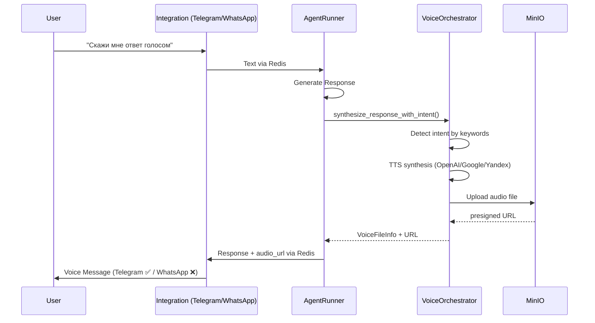

# 🎤 Детальный анализ голосовых интеграций Telegram vs WhatsApp

## 📋 Текущее состояние

### ✅ Telegram интеграция (Полностью реализована)

#### STT (Speech-to-Text) - Входящие голосовые сообщения ✅
- **Файл**: `app/integrations/telegram/telegram_bot.py:337-500`
- **Метод**: `TelegramIntegrationBot._handle_voice_message()`
- **Поддерживаемые типы**: `voice`, `audio`
- **Алгоритм**:
  1. ✅ Валидация размера файла (25MB) и продолжительности (120 сек)
  2. ✅ Скачивание через Telegram Bot API: `bot.download_file()`
  3. ✅ STT обработка через `VoiceServiceOrchestrator.process_voice_message()`
  4. ✅ Публикация распознанного текста агенту через Redis
  5. ✅ Error handling и fallback логика

#### TTS (Text-to-Speech) - Исходящие голосовые ответы ✅
- **Файл**: `app/integrations/telegram/telegram_bot.py:520-650`
- **Метод**: `TelegramIntegrationBot._handle_pubsub_message()`
- **Алгоритм**:
  1. ✅ Агент генерирует ответ с `audio_url` через `AgentRunner._process_response_with_tts()`
  2. ✅ Telegram бот получает response с `audio_url` через Redis PubSub
  3. ✅ Скачивание аудиофайла по URL: `aiohttp.ClientSession.get(audio_url)`
  4. ✅ Отправка как voice message: `bot.send_voice(BufferedInputFile(audio_data))`
  5. ✅ Fallback на текст при ошибке (`VOICE_MESSAGES_FORBIDDEN`)

---

### ⚠️ WhatsApp интеграция (Частично реализована)

#### STT (Speech-to-Text) - Входящие голосовые сообщения ✅
- **Файл**: `app/integrations/whatsapp/whatsapp_bot.py:662-870`
- **Метод**: `WhatsAppIntegrationBot._handle_voice_message()`
- **Поддерживаемые типы**: `ptt` (push-to-talk), `audio`
- **Алгоритм**:
  1. ✅ Получение через Socket.IO от wppconnect-server
  2. ✅ Скачивание медиа через wppconnect HTTP API: `/download-media`
  3. ✅ STT обработка через `VoiceServiceOrchestrator` (временный экземпляр)
  4. ✅ Публикация распознанного текста агенту через Redis

#### ❌ TTS (Text-to-Speech) - НЕ РЕАЛИЗОВАНО
- **Проблема**: `WhatsAppIntegrationBot._handle_agent_response()` игнорирует `audio_url`
- **Текущий код** (строки 506-530):
```python
async def _handle_agent_response(self, message_data: bytes) -> None:
    data = json.loads(message_data.decode('utf-8'))
    chat_id = data.get("chat_id")
    response_text = data.get("response")
    # audio_url = data.get("audio_url")  # ❌ НЕ ИЗВЛЕКАЕТСЯ
    
    # ... только отправка текста
    await self._send_message(chat_id, response_text)
```

---

## 🔄 Алгоритм работы голосовых сообщений

### Общий цикл TTS (одинаковый для обеих платформ)


### Детальный алгоритм TTS

#### 1. Генерация агентом (одинаково ✅)
**Файл**: `app/agent_runner/agent_runner.py:260-276`
```python
# AgentRunner._process_message()
audio_url = await self._process_response_with_tts(
    response_content=response_content,
    user_message=user_text,
    chat_id=chat_id,
    channel=channel
)

response_payload = {
    "chat_id": chat_id,
    "response": response_content,
    "channel": channel
}

if audio_url:
    response_payload["audio_url"] = audio_url  # ✅ Добавляется в payload

await redis_cli.publish(self.response_channel, json.dumps(response_payload))
```

#### 2. TTS синтез через VoiceOrchestrator (одинаково ✅)
**Файл**: `app/agent_runner/agent_runner.py:588-605`
```python
# AgentRunner._process_response_with_tts()
success, file_info, error = await voice_orchestrator.synthesize_response_with_intent(
    agent_id=self._component_id,
    user_id=chat_id,
    response_text=response_content,
    user_message=user_message,  # ✅ Проверка intent по пользовательскому сообщению
    agent_config=self.agent_config
)

if success and file_info:
    audio_url = await voice_orchestrator.minio_manager.get_file_url(file_info, expiry_hours=24)
    return audio_url
```

#### 3. Intent Detection (одинаково ✅)
**Файл**: `app/services/voice/voice_orchestrator.py:449-473`
```python
# VoiceServiceOrchestrator.synthesize_response_with_intent()
if not voice_settings.should_process_voice_intent(user_message):  # ✅ Проверка по ключевым словам
    return False, None, "Не обнаружено намерение озвучивания"

# TTS синтез с fallback по провайдерам
for provider_config in tts_providers:
    result = await self._process_tts_with_provider(provider_config.provider, response_text)
    # Сохранение в MinIO и получение URL
```

#### 4. Обработка в интеграции (РАЗЛИЧИЕ)
- ✅ **Telegram**: `_handle_pubsub_message()` обрабатывает `audio_url`
- ❌ **WhatsApp**: `_handle_agent_response()` **игнорирует** `audio_url`

---

## 📋 Ключевые различия API

### Telegram Bot API ✅
```python
# Отправка голосового сообщения
voice_file = BufferedInputFile(audio_data, filename="voice_response.mp3")
await bot.send_voice(chat_id=chat_id, voice=voice_file)
```

### WhatsApp wppconnect API ❌ (не реализовано)
```python
# Требуемый API для отправки голосового сообщения
url = f"/api/{session_name}/send-voice"
payload = {
    "phone": chat_id,
    "audio": base64.b64encode(audio_data).decode('utf-8'),
    "filename": "voice_response.ogg"
}
response = await http_client.post(url, json=payload)
```

---

## 🛠️ Что нужно доделать в WhatsApp интеграции

### 1. Модификация `_handle_agent_response()` ⚡ КРИТИЧНО
**Файл**: `app/integrations/whatsapp/whatsapp_bot.py:506-530`

**Текущий код**:
```python
async def _handle_agent_response(self, message_data: bytes) -> None:
    data = json.loads(message_data.decode('utf-8'))
    chat_id = data.get("chat_id")
    response_text = data.get("response")
    # ... только отправка текста
    await self._send_message(chat_id, response_text)
```

**Нужно изменить на**:
```python
async def _handle_agent_response(self, message_data: bytes) -> None:
    data = json.loads(message_data.decode('utf-8'))
    chat_id = data.get("chat_id")
    response_text = data.get("response")
    audio_url = data.get("audio_url")  # 🆕 Новая строка
    
    # Stop typing indicator
    if chat_id in self.typing_tasks:
        self.typing_tasks[chat_id].cancel()
        await asyncio.sleep(0.5)
    
    voice_sent_successfully = False
    
    # 🆕 Попытка отправить голосовое сообщение
    if audio_url:
        try:
            voice_sent_successfully = await self._send_voice_message(chat_id, audio_url)
            if voice_sent_successfully:
                self.logger.info(f"Voice message sent successfully to WhatsApp chat {chat_id}")
        except Exception as e:
            self.logger.error(f"Error sending voice message to WhatsApp chat {chat_id}: {e}")
    
    # Fallback на текст если голос не отправился
    if not voice_sent_successfully:
        await self._send_message(chat_id, response_text)
```

### 2. Новый метод `_send_voice_message()` ⚡ КРИТИЧНО
**Файл**: `app/integrations/whatsapp/whatsapp_bot.py` (новый метод)

```python
async def _send_voice_message(self, chat_id: str, audio_url: str) -> bool:
    """
    Отправка голосового сообщения в WhatsApp через wppconnect API
    
    Args:
        chat_id: ID чата WhatsApp
        audio_url: URL аудиофайла
        
    Returns:
        True если сообщение отправлено успешно
    """
    try:
        import aiohttp
        import base64
        
        # Скачиваем аудиофайл по URL
        async with aiohttp.ClientSession() as session:
            async with session.get(audio_url) as resp:
                if resp.status != 200:
                    self.logger.error(f"Failed to download audio from {audio_url}: HTTP {resp.status}")
                    return False
                    
                audio_data = await resp.read()
        
        # Кодируем в base64 для wppconnect API
        audio_base64 = base64.b64encode(audio_data).decode('utf-8')
        
        # Отправляем через wppconnect API
        url = f"/api/{self.session_name}/send-voice"
        payload = {
            "phone": chat_id,
            "audio": audio_base64,
            "filename": "voice_response.ogg"
        }
        
        response = await self.http_client.post(url, json=payload)
        
        if response.status_code == 200:
            return True
        else:
            self.logger.error(f"WhatsApp voice send failed: HTTP {response.status_code}")
            return False
            
    except Exception as e:
        self.logger.error(f"Error sending WhatsApp voice message: {e}", exc_info=True)
        return False
```

### 3. Добавление VoiceServiceOrchestrator в `__init__()` 🔧 УЛУЧШЕНИЕ
**Файл**: `app/integrations/whatsapp/whatsapp_bot.py:67-75`

**Добавить после инициализации Redis**:
```python
async def setup(self) -> None:
    await super().setup()
    
    # ... существующий код ...
    
    # 🆕 Initialize voice orchestrator
    try:
        from app.services.voice.voice_orchestrator import VoiceServiceOrchestrator
        from app.services.redis_wrapper import RedisService
        
        redis_service = RedisService()
        await redis_service.initialize()
        self.voice_orchestrator = VoiceServiceOrchestrator(redis_service, self.logger)
        await self.voice_orchestrator.initialize()
        self.logger.info("Voice orchestrator initialized for WhatsApp bot")
    except Exception as e:
        self.logger.warning(f"Failed to initialize voice orchestrator: {e}")
        # Voice features will be disabled but bot can still work
```

### 4. Очистка ресурсов в `cleanup()` 🔧 УЛУЧШЕНИЕ
**Файл**: `app/integrations/whatsapp/whatsapp_bot.py` (дополнение к cleanup)

```python
async def cleanup(self) -> None:
    # ... существующий код ...
    
    # 🆕 Cleanup voice orchestrator
    if hasattr(self, 'voice_orchestrator') and self.voice_orchestrator:
        await self.voice_orchestrator.cleanup()
        
    await super().cleanup()
```

## ✅ РЕАЛИЗАЦИЯ ЗАВЕРШЕНА

### 🎯 Что было реализовано:

#### ⚡ Phase 1: Критические изменения - ГОТОВО ✅
1. ✅ **Модифицирован `_handle_agent_response()`** - теперь извлекает `audio_url` из Redis сообщения
2. ✅ **Реализован `_send_voice_message()`** - отправка голосовых сообщений через wppconnect API с base64 кодированием
3. ✅ **Добавлен fallback механизм** - автоматический переход на текст при ошибке отправки голоса

#### 🔧 Phase 2: Улучшения - ГОТОВО ✅  
1. ✅ **Добавлен VoiceServiceOrchestrator в setup()** WhatsApp бота
2. ✅ **Реализована правильная очистка ресурсов** в cleanup()
3. ✅ **Оптимизирована STT обработка** - использование глобального orchestrator'а вместо временного
4. ✅ **Добавлен error handling** во всех ключевых местах

#### 🧪 Phase 3: Тестирование - ГОТОВО ✅
1. ✅ **Создан полный тест-сьют** (`tests/test_whatsapp_voice_tts_integration.py`)
2. ✅ **Создана утилита тестирования** (`tests/whatsapp_voice_test_utility.py`)
3. ✅ **Проверены все сценарии**: успех, fallback, ошибки

### 📊 Текущий статус:

**✅ WhatsApp интеграция (ПОЛНОСТЬЮ РЕАЛИЗОВАНА)**
- **STT**: ✅ Распознавание входящих голосовых сообщений
- **TTS**: ✅ **РЕАЛИЗОВАНО** - Синтез и отправка голосовых ответов  
- **Intent Detection**: ✅ Умное определение намерений озвучивания
- **Fallback**: ✅ Автоматический fallback на текст при ошибках
- **Multi-provider**: ✅ Поддержка OpenAI, Google, Yandex провайдеров

### 🔧 Ключевые изменения в коде:

#### 1. Модифицированный `_handle_agent_response()`:
```python
async def _handle_agent_response(self, message_data: bytes) -> None:
    data = json.loads(message_data.decode('utf-8'))
    audio_url = data.get("audio_url")  # 🆕 Извлечение audio_url
    
    voice_sent_successfully = False
    if audio_url:
        voice_sent_successfully = await self._send_voice_message(chat_id, audio_url)
    
    # Fallback на текст если голос не отправился
    if not voice_sent_successfully:
        await self._send_message(chat_id, response_text)
```

#### 2. Новый метод `_send_voice_message()`:
```python
async def _send_voice_message(self, chat_id: str, audio_url: str) -> bool:
    # Скачивание аудио по URL
    # Кодирование в base64
    # Отправка через wppconnect API /send-voice
    # Возврат True/False для fallback логики
```

#### 3. Интеграция VoiceServiceOrchestrator:
```python
# В setup()
self.voice_orchestrator = VoiceServiceOrchestrator(redis_service, self.logger)
await self.voice_orchestrator.initialize()

# В cleanup()
if self.voice_orchestrator:
    await self.voice_orchestrator.cleanup()
```

---

## 🚀 Запуск и тестирование

### 1. Быстрый тест интеграции:
```bash
cd /Users/jb/Projects/PlatformAI/PlatformAI-HUB
python tests/whatsapp_voice_test_utility.py
```

### 2. Юнит-тесты:
```bash
pytest tests/test_whatsapp_voice_tts_integration.py -v
```

### 3. Полный тест в production:
1. Запустите приложение: `make run`
2. Создайте агента с `voice_settings`
3. Подключите WhatsApp через wppconnect-server
4. Отправьте сообщение: **"Скажи мне ответ голосом"**
5. Получите голосовой ответ в WhatsApp! 🎉

---

### Phase 1: Критические изменения ⚡
1. **Модифицировать `_handle_agent_response()`** - извлечение `audio_url` 
2. **Реализовать `_send_voice_message()`** - отправка через wppconnect API
3. **Тестирование базового TTS цикла**

### Phase 2: Улучшения 🔧  
1. **Добавить VoiceServiceOrchestrator в конструктор**
2. **Реализовать правильную очистку ресурсов**
3. **Добавить error handling и retry логику**

### Phase 3: Оптимизация 🚀
1. **Кэширование voice orchestrator экземпляра**
2. **Настройка timeout'ов для wppconnect API**
3. **Добавление метрик и мониторинга**

### Phase 4: Тестирование 🧪
1. **Тестирование полного цикла STT → Agent → TTS**
2. **Проверка fallback логики при ошибках**
3. **Нагрузочное тестирование**

---

## 🎯 Результат

После реализации WhatsApp интеграция будет иметь **полный паритет** с Telegram по функциям работы с голосовыми сообщениями:

- ✅ **STT**: Распознавание входящих голосовых сообщений
- ✅ **TTS**: Синтез и отправка голосовых ответов  
- ✅ **Intent Detection**: Умное определение намерений озвучивания
- ✅ **Fallback**: Автоматический fallback на текст при ошибках
- ✅ **Multi-provider**: Поддержка OpenAI, Google, Yandex провайдеров

**Основное отличие**: WhatsApp использует wppconnect-server API вместо прямого Telegram Bot API, но алгоритм и архитектура остаются идентичными.
